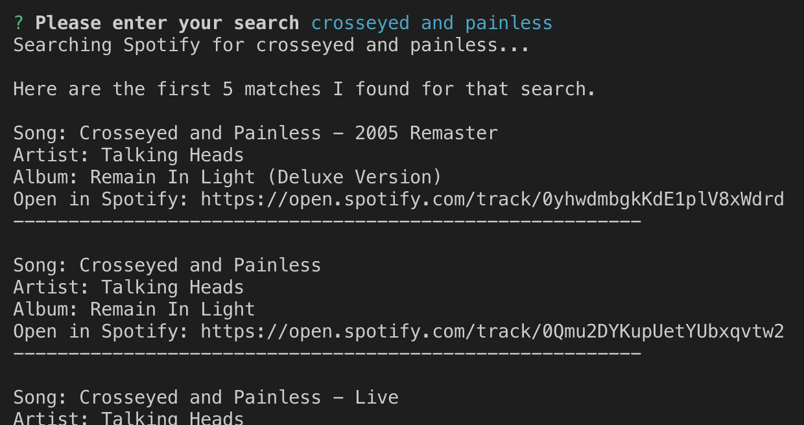

# Liri

## A helper bot that can look up concert events for a band/artist, search Spotify for a song, or search OMDB for a movie. You can also choose to do what Liri wants, which allows Liri to randomly search for one ofs her favorite artists, songs, or movies.

### Overview

This app is initiated from the command line. When the app is run, the user is prompted to select what type of search they would like:

After the search results are returned, Liri checks to see if the user would like to run an additional search. This will continue indefinitely until the user declines to have Liri do another search.

#### Movie results: 

#### Song results:

#### Concert results:

#### Liri favorites result:

### How to use

1. Navigate - In your terminal window, navigate to the directory that contains your version of the Liri app.
2. Initiate the app - Call the liri.js file by entering the command `node liri.js`
3. Choose search - When prompted to choose a search type, use the up/down arrow keys to choose your selection, then press enter.
4. Enter search - If you chose to search for a movie, song, or artist, you will be prompted to type in your search. Liri's search engine is case insensitive.
5. Search again - After the results are returned, let Liri know whether or not you want to search again. 

### Technologies
#### APIs Used:

- [OMDB](http://www.omdbapi.com/)
- [Bands in Town](http://www.artists.bandsintown.com/bandsintown-api)

#### NPM Packages Used:

- [node-spotify-api](https://www.npmjs.com/package/node-spotify-api) - Used to search for songs in Spotify.
- [inquirer](https://www.npmjs.com/package/inquirer) - Used to collect input from the user.
- [axios](https://www.npmjs.com/package/axios) - Used to make HTTP requests.
- [moment](https://www.npmjs.com/package/moment) - Used to format date variables.
- [dotenv](https://www.npmjs.com/package/dotenv) - Used to securely reference authentication credentials from the `.env` file.

#### Built-in Node Packages:

- [fs](https://nodejs.org/api/fs.html) - Used to reference Liri's favorites from the `liriFaves.txt` file.

### Development
This application was developed solely by James Cutler, according to instructions/specifications provided by the UNH Coding Bootcamp. 